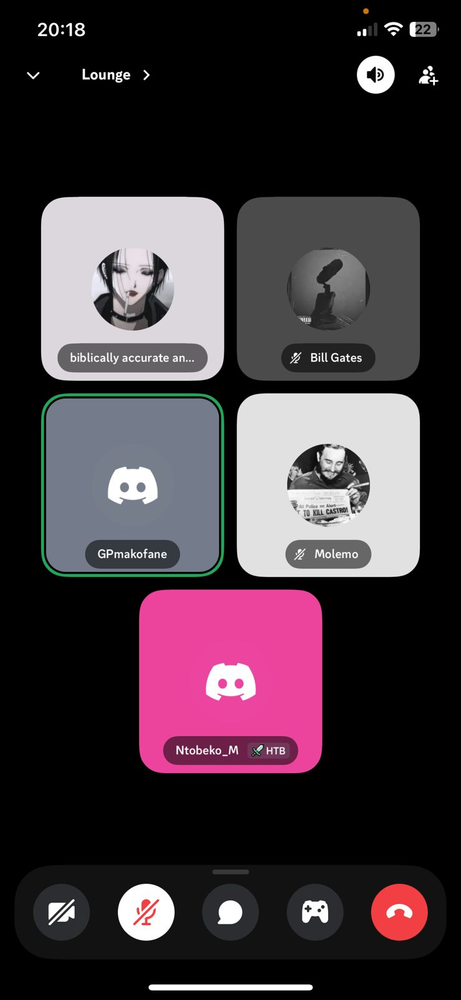

# 📝Scrum 01 Minutes

**Date:** August 10, 2025  
**Time:** 20:00 – 20:22  
**Location:** Discord (Online)  
**Facilitator:** Given (Scrum Master)  

---

## 📋 Agenda

### 1. 🔹 Welcome & Context (1 min)
- Brief greeting and reminder that this is a quick standup (max 15 min)
- Recap Sprint 1 goals:
  - GitHub repo setup
  - Wireframes for landing page, sign in/up, dashboard
  - Landing page, sign in/up, home page with buttons, calendar with “Create Event” button
  - Documentation site setup

### 2. 🔹 Team Updates (10 min)
Each member answers:
1. What I worked on since last meeting/kickoff  
2. What I’m working on next  
3. Any blockers?  

### 3. 🔹 Reminders & Next Steps (1 min)
- Keep Trello updated after every work session  
- Follow branching & PR review process  
- Standup schedule: Tue, Thu, Sun  
- Next retrospective after Sprint 1 ends  

### 4. 🔹 Close Meeting (30 sec)
- Thank the team  
- Next standup: Tuesday, 12 August 2025

---

## 📝 Minutes

### Attendees
- Given  
- Kutlwano  
- Molemo  
- Ntando  
- Ntobeko  

**Absentees:** Alfred  

---

### 1. What the team has been able to accomplish
- Molemo: Started implementing server and routes; connected to MongoDB database.  
- Kutlwano: Created mock application using AI UI tools; findings will assist in frontend build.  
- Ntobeko & Ntando: Created wireframes for the UI.  
- Given: Created the documentation site for the project.  

---

### 2. Any blockers experienced
- No blockers reported.  

---

### 3. What the team will be doing moving forward
- Members to get access to database.  
- Finalise UI design.  
- Continuously augment documentation.  

---

### 4. Reminders for the team
- Keep Trello updated after every work session.  
- Follow branching & PR review process.  
- Standup schedule: Tue, Thu, Sun.  
- Next retrospective after Sprint 1 ends.  

---

## ✅ Action Items
- **Molemo**: Give database access to all team members; continue implementing routes with Kutlwano.  
- **Kutlwano**: Continue frontend development alongside backend collaboration.  
- **Ntando & Ntobeko**: Finalise application design.  
- **Given**: Continue documentation work.  

---

## Meeting proof:

[Watch Scrum 01 Video](../../assets/meetings/scrum01/scrum01.mp4)

---

## 📅 Next Meeting
**Date:** August 12, 2025  
**Time:** 15:00  
**Location:** MSL
