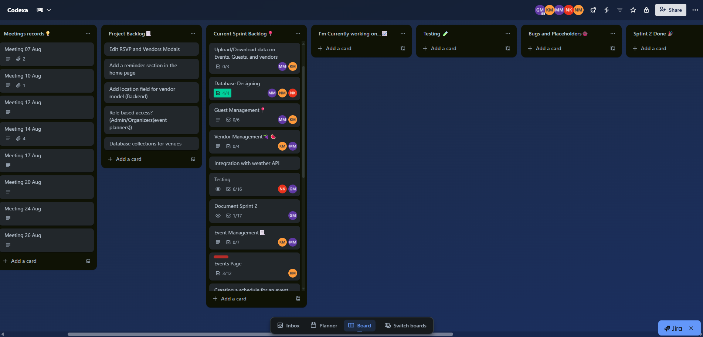
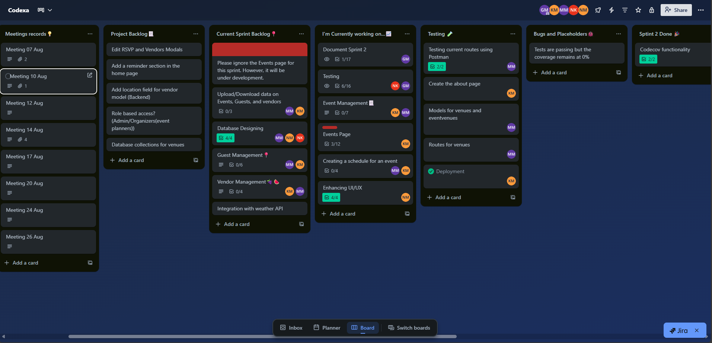
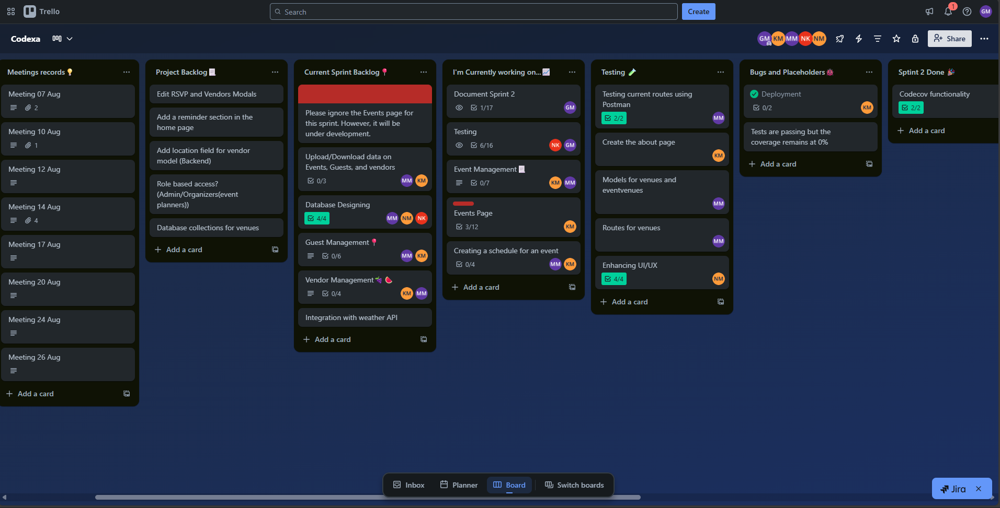
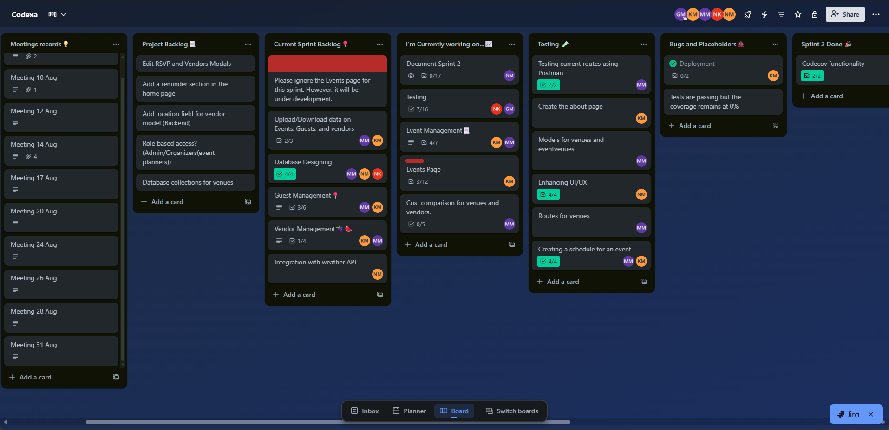

# PlanIt Event Planner: Sprint 2 Development Plan 

## 1. Sprint Goal
Deliver core functionality of the Event Planning system, while ensuring testing, feedback, and documentation processes are in place.

## 2. Tasks / Features with Responsibilities

### 🧑‍🏫 Scrum Master: Given
**Responsibilities & Tasks:**
- Facilitate standups and sprint retrospectives
- Ensure Scrum principles are followed
- Track sprint progress on Trello
- Remove blockers for the team
- Oversee constant update of documentation site

---

### 📃 Documentation Specialist: Given
**Responsibilities & Tasks:**
- Maintain project documentation in Markdown
- Publish documentation via GitHub Pages
- Ensure meeting minutes and agendas are recorded
- Update documentation site with sprint progress and technical notes

---

### 🧑‍💻 Backend Developers: Molemo & Kutlwano
**Responsibilities & Tasks:**
- Set up server and database (Node.js, Express, MongoDB)
- Implement API endpoints
- Handle OAuth authentication (Kutlwano)
- Ensure secure and efficient data flow
- Implement event creation with automatic status updates
- Guest management (upload/download guest lists)
- Vendor management (compare vendors by availability and affordability)
- Event scheduling (time slots, exportable as PDF/CSV)
- File uploads/downloads (floorplans, documents)
- Integrate external API (Weather API)
- Maintain stability (track bugs using bug tracker)

---

### 🧑‍💻 Frontend Developers: Ntando, Ntobeko, Kutlwano
**Responsibilities & Tasks:**
- Build UI components with React, Vite, Tailwind CSS
- Integrate Material Tailwind & Framer Motion
- Implement responsive design
- Connect frontend to backend APIs
- Calendar integration (create events from clicking on the calendar)
- Vendor browsing & management page (view, compare, select vendors)
- Enhancing the UI for responsiveness

---

### 🧪 Code Tester / QA: Ntando
**Responsibilities & Tasks:**
- Write and run test cases
- Ensure features work as expected before deployment
- Report and document bugs
- Web app testing (frontend, backend, integration, E2E)
- Track bug fixes and report status to team (on Trello, Github isssues)

---

### 🚀 DevOps Engineer: Kutlwano
**Responsibilities & Tasks:**
- Set up CI/CD pipelines
- Deploy web app to Microsoft Azure
- Maintain production environment
- Ensure smooth deployment of backend and frontend

---

## 3. 👤 User Stories with Acceptance Criteria

**User Story 1: Event Management**  
**As an** event planner, **I want to** click on a "create event button" or a date on the calender to create a new event **so that** I can track all the event details and manage it.

**Acceptance Criteria:**  
- The UI has a form to enter event details (title, date, time, description).  
- The event is saved to the database when submitted.  
- The newly created event appears in the dashboard/calendar.    

---

**User Story 2: Guest Management**  
**As an** event planner, **I want to** download guest lists **so that** I can easily manage my attendees.

**Acceptance Criteria:**    
- Users can download guest lists as CSV or Json file. 
- Users can see the complete guest list on the downloaded file

---

**User Story 3: Guest Management**  
**As an** event planner, **I want to** send RSVP to my guests **so that** they can revieve my invitation

**Acceptance Criteria:**    
- Users can see the list of all invitations sent out
- Users can track status of the rsvps sent out to attendees

---

**User Story 4: Vendor Management**  
**As an** event planner, **I want to** browse, compare, and select vendors based on affordability **so that** I can choose the best options for my events.

**Acceptance Criteria:**  
- Users can view a list of vendors with details (name, services, cost).  
- Vendors can be filtered by cost, or other category.  
- Users can select and link vendors to specific events.  
- Selected vendors appear in the event details page.  

---

**User Story 5: Event Management**  
**As an** event planner, **I want to** be able to click on an "Edit Event" button in an event **so that** I can edit/manage an event that have created.

**Acceptance Criteria:**  
- Users can change date and time of an event
- Users can change the location of an event

---

## 3. ⌛ Sprint Timeline

- Below are snapshots of our Trello board as we progress through the entire sprint. The trello board can be accessed via this [Link](https://trello.com/invite/b/688926a06672f847b26eadd8/ATTI44809ab9733ae3526b4a7133a7e97f41E5E6470D/codexa)

- Our Trello board as of 20 August 2025:

- Our Trello board as of 24 August 2025:

- Our Trello board as of 26 August 2025:

- Trello board as of 31 August 2025:

---
