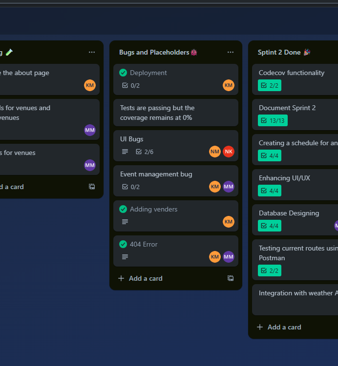

# 🧪 Testing
We are implementing testing at three levels: frontend, backend, and end-to-end.

## 1. Testing Strategy
- **Frontend** → Unit & integration testing with Vitest + React Testing Library.
- **Backend** → API endpoint testing with Jest + Supertest.
- **End-to-End** (E2E) → Automated user flows tested with Playwright.
- **Manual Testing** → Exploratory tests by the dev team.
- **User Testing** → Google Forms distributed to real users for UX feedback.

## 2. Automated Testing
### 1. Frontend Unit & Integration Tests → Vitest + React Testing Library
```bash
npm install --save-dev vitest @testing-library/react @testing-library/jest-dom      #install
npx vitest      #test
```
- Vitest → Chosen because it is optimized for Vite projects, fast
- React Testing Library → Helps ensure UI components work as expected from a user perspective.
- @testing-library/jest-dom → Provides expressive matchers for DOM node assertions.

### 2. End-to-End (E2E) Tests → Playwright
```bash
npm install --save-dev @playwright/test #install
npx playwright test         #test
```
- Playwright → Chosen for cross-browser testing (Chromium, Firefox, WebKit). Provides automated testing that simulates real user interactions across multiple devices and screen sizes.

### 3. Backend Tests → Jest + Supertest
**Install:**
```bash
npm install --save-dev jest supertest       #install
npx jest        #test
```
- Jest → A widely adopted JavaScript testing framework, simple configuration, good for asynchronous tests.
- Supertest → Specialized for testing HTTP APIs in Node.js, making it easy to assert responses from Express routes

## 3. Manual Testing
- Each feature manually tested before merging to main.
- Bug tracking handled via [GitHub](https://github.com/Codexa-v1/Codexa) Issues + [Trello](https://trello.com/b/1v7ctfOX/codexa).
- 
- 

## 4. User Feedback
- **[Google Form](https://docs.google.com/forms/d/e/1FAIpQLSeQoMUbDmMaMzPh1MDD8YCQLu8-IxFAlJN5ozyVCMwD-llzKg/viewform?usp=header)** was distributed to peers for user reviews.
- Questions included: ease of login, event creation flow, UI intuitiveness, problems faced, places for improvement...
- Results were compiled and analyzed, feedback that may be integrated into next sprint include:
    - UI adjustments, fixing confusing flows.
    - Prevent invalid inputs on user input prompts
    - Adding additional features on the app (event reminders, AI assistant, ID as a requirement for guests)
    - uploading and downloading documents
- 