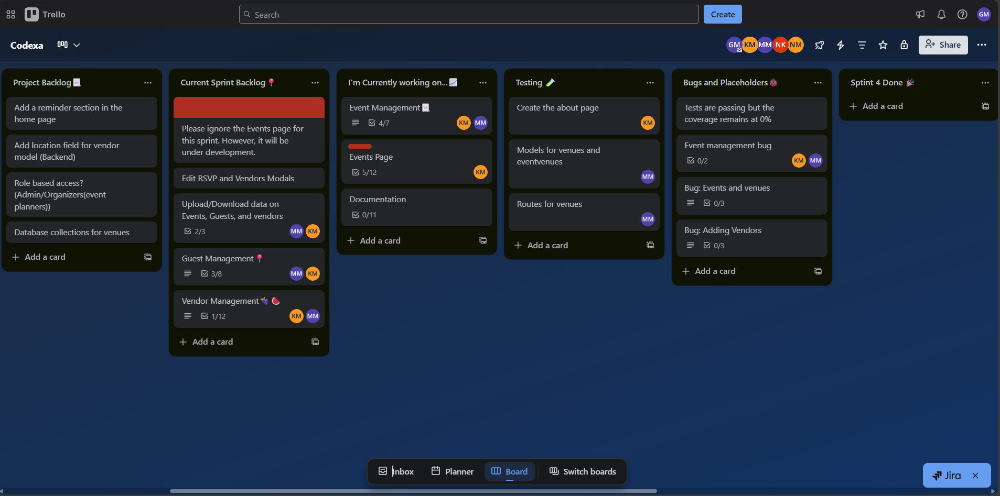

# PlanIt Event Planner: Sprint 4 Development Plan 

## 1. 🎯 Sprint Goal
Deliver a **feature-complete, stable, well-documented, and deployed** event-planner application that meets all requirements, production-ready database and API, fully functional web app (responsive & accessible), comprehensive documentation, thorough testing, and clear evidence of Agile process and stakeholder interaction.

- **Deployed Web App** (publicly accessible URL; production-ready).  
- **Deployed API** (externally available and documented).  
- **Database** deployed with sample/production data and schema documentation.   
- **Automated Test Evidence**: Unit, integration, and E2E test suites with coverage reports (target **≥80%**).  
- **Bug Tracker Evidence**: Active GitHub Issues / Trello with recent items, fixes, and linked PRs.  
- **Reports**: Submit Group report and individual report.ing adherence to Agile Scrum through standups, retros, and backlog tracking.  

---

## 2. 🛠️ Tasks / Features with Responsibilities (Roles)

### 🧑‍🏫 Scrum Master: **Given**
- Facilitate standups (Tue, Thu, Sun) and retrospectives.  
- Track sprint progress in Trello (burndown, blockers, priorities).  
- Ensure backlog is groomed and aligned with rubric.  
- Oversee documentation site updates.  

### 📃 Documentation Specialist: **Given**
- Record meeting minutes, agendas, and stakeholder reviews.  
- Document testing approach (what’s tested, what isn’t, justification).  
- Maintain Sprint 3 Development Plan and publish on docs site.  
- Monitor User feedback using google forms

### 🧑‍💻 Backend Developers: **Molemo & Kutlwano**
- Guest Management:  
  - Replace email as guest ID → event-specific unique IDs.  
  - Add **VIP Guest feature**.  
- Vendor Management:  
  - Input validation (alert if missing fields).  
  - Vendor comparison (availability + affordability).  
  - Prevent double booking.  
  - Implement budget tracking (alerts + cost subtraction).  
- Implement auto-reload & faster refresh.  
- Maintain bug tracker entries for backend issues.  

### 🧑‍💻 Frontend Developers: **Ntando, Ntobeko, Kutlwano**
- Build responsive UI components (React, Vite, Tailwind, Material Tailwind, Framer Motion).  
- Guest management UI (VIP tag, guest list upload/download).  
- Vendor browsing & management UI (compare vendors, budget warnings).  
- Enhance responsiveness for small/large screens.  
- Connect UI to backend APIs and ensure smooth data flow.  

### 🧪 Code Tester / QA: **Ntando**
- Write & run automated test cases:  
  - Unit tests (frontend + backend).  
  - Integration tests (guest/vendor flows).  
  - End-to-End (E2E) tests.  
- Document testing scope on GitHub:  
  - What is tested, what is not tested, why.  
- Manual testing for UI/UX issues.  
- Report & document bugs (Trello + GitHub issues).  
- Track bug fixes and report status.  

### 🚀 DevOps Engineer: **Kutlwano**
- Maintain CI/CD pipelines with GitHub Actions.  
- Deploy app to Microsoft Azure.  
- Integrate automated test suite into pipeline (≥80% coverage gate).  
- Ensure production environment stability.  
- Monitor performance benchmarks.  

---

## 3. 👤 User Stories with Acceptance Criteria

### User Story 1: Guest Management
**As an event planner,** I want to sent an invite to my guests, **so that** they can accept or decline my invitation
- **Acceptance Criteria:**  
  - Guests can be added without duplicate errors.  
  - Each Guest recieves an invite link via emial
  - Guests can click on the link and accept or decline my invitation

---

### User Story 2: Vendor Management
**As an event planner,** I want to search for vendors on the app, **so that** I can select the one that is most suitable for my event.  
- **Acceptance Criteria:**  
  - I can search vendors from the search bar.   
  - Added vendors can be seen by other users on the platform.  

---

### User Story 3: App Performance
**As an event planner,** I want the app to refresh automatically after changes, **so that** I can see updated information without manually reloading.  
- **Acceptance Criteria:**  
  - Pages refresh automatically after guest/vendor changes.  
  - No noticeable performance lag

---

### User Story 4: Document management
**As an event planner,** I want to upload documents to my event **so that** I can keep event relevant information like reciepts as documents on the web app  
- **Acceptance Criteria:**  
  - Users can delete or download documents they have uploaded
  - Users can view the documents they have uploaded onto an event

---

## 3. ⌛ Sprint Timeline
- Below are snapshots of our Trello board as we progress through the entire sprint. The trello board can be accessed via this [Link](https://trello.com/invite/b/688926a06672f847b26eadd8/ATTI44809ab9733ae3526b4a7133a7e97f41E5E6470D/codexa)

- Our trello board as pf 07 October 2025

---
